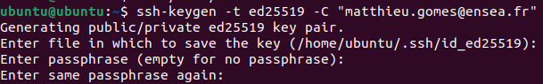
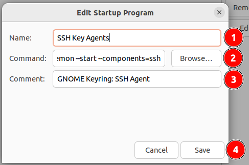
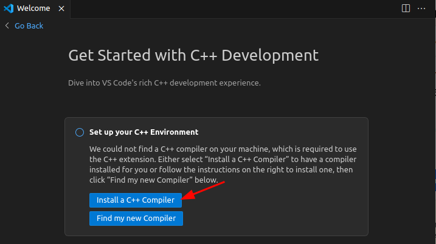

# Préparation de base

## Te connecter à l'internet de l'école

0. Clique dans le coin en haut à droit de ton ecran

1. Clique sur le wifi
   
2. Clique sur > dans la case wifi
3. Clique sur "All networks"
4. Clique sur "Eduroam" dans la liste des réseaux disponibles
5.  
6. Verifie que la configuration du reseau est bien la suivante   
Et si ce n'est pas le cas, règle la configuration dans l'odre indiqué par les points


## Installer et configurer tous les outils nécessaires pour le TP

0. Ovre un terminal (Ctrl+Alt+T ou, dans le menu applications (en bas à gauche))

### Git

1. Tape la commande  
```sudo apt install git -y```
2. Entre ton mot de passe quand il t'est demandé (tu ne verras pas les caractères que tu tapes, c'est normal) et appuie sur entrée
3. Une fois que tu peux de nouveau taper des commandes, tape la commande  
   ```git --version```   
pour verifier que git est bien installé : si ce que tu vois sur le screen s'affiche, c'est bon  

4. Tape la commande suivante :  
```git config --global user.name <ton pseudo github>```  
puis  
```git config --global user.email <ton email github>```  
en n'utilisant pas les "<>"

### Configuration clé SSH pour github

1. Tape la commande  
```ssh-keygen -t rsa -b 4096 -C "<ton email github>"```  

2. Appuie sur entrée pour valider le chemin par défaut (tu pourrais choisir le nom et l'emplacement de ta clé, mais on sait tous les deux qu'on a peu de chance d'en faire souvent donc on va pas s'ebeter à personnaliser de détail)
3. Entre un mot de passe pour ta clé (tu ne verras pas les caractères que tu tapes, c'est normal) (autant prendre celui de ton ubuntu, c'est plus simple)   

4. Entre le même mot de passe pour confirmer  
 
5. Après avoir obtenu le message suivant,  
  
tape la commande  
```eval "$(ssh-agent -s)"```  

6. Tape la commande  
```ssh-add ~/.ssh/id_ed25519```  
Et entre le mot de passe de ta clé SSH (celui que tu as choisi à l'étape 3 et tu ne verras pas les caractères que tu tapes, c'est normal)

7. Tape la commande  
```cat ~/.ssh/id_ed25519.pub```  

8. Selectionne la reponse dans le terminal (avec ta souris) et copie la (Ctrl+Shift+C)  

9. Ouvre firefox et va sur ton compte github
10. Clique sur ton avatar en haut à droite de la page  
  
11. Clique sur "Settings"  
  
12. Clique sur "SSH and GPG keys"

13. Clique sur "New SSH key"

14. Choisi un nom pour ta clé (Ubuntu, par exemple) (1) puis colle la clé que tu as copiée à l'étape 8 dans le champ "Key" (2) et clique sur "Add SSH key" (3) 


### Autostart du SSH-agent 

Pour s'assurer que tout fonctionne dès le démarrage de ton ubuntu, on va automatiser le lancement du ssh-agent

1. Alt+F2  

2. Tape  
```gnome-session-properties```    
et appuie sur entrée  

3. Si tu as déjà une entrée appelée "SSH Key Agent", comme ici :  
  
tu peux passer à l'installation de [VSCode](#vscode) Sinon, appuie sur "Add"  

4. Remplis les champs :  
   (1) SSH Key Agent  
   (2) `/usr/bin/gnome-keyring-daemon --start --components=ssh`  
   (3) GNOME Keyring: SSH Agent  
  
   Puis clique sur "Add" (4)
5. Ferme la fenêtre

## VSCode

1. Va sur ce le site de telechargement de [VSCode](https://code.visualstudio.com/download)
2. Clique sur `.deb x64`  

3. Une fois le téléchargement terminé, dans ta console déjà ouverte, tape la commande    
```cd ~/Downloads```
4. Ensuite, entre la commande  
```sudo apt-get install ./*.deb -y && find . -name "*.deb" -type f -delete```  

5. Un ecran rose apparait : appuie sur entrée 
 
6. Une fois que tu peux de nouveau taper des commandes, tape la commande  
```code --version```   
Si une version s'affiche, comme celle sur le screen, c'est bon


## Clone du projet de TP

1. Choisi un dossier où tu veux mettre le dossier du projet (par exemple, Documents ou Bureau)
2. Dans le terminal tape la commande :  
`git clone git@github.com:MatthieuGomes/TP1_Synthese.git <chemin/du/dossier>/TP1_Synthese`  
(en remplaçant `<chemin/du/dossier>` par le chemin du dossier que tu as choisi à l'étape 1 (`~/Documents` ou `~/Desktop` par exemple))  
3. Quand la commande s'intterompt et te demande `Are you sure you want to continue connecting (yes/no/[fingerprint])?`, tape `yes` puis entrée

4. Entre le mot de passe de ta clé SSH (celui que tu as choisi à l'étape 3 et tu ne verras pas les caractères que tu tapes, c'est normal)

## Configuration de VSCode pour le C

1. Dans le terminal, tape la commande  
`cd <chemin/du/projet>`  
(en remplaçant `<chemin/du/dossier>` par le chemin du dossier du projet que tu as cloné à l'étape précédente)
2. Ouvre VSCode 
   a. Soit via les applications (en bas à gauche)
   b. Soit en tapant  
   `code`  
   dans le terminal 
3. Clique sur l'icone d'extension  

4. Tape "C/C++" dans la barre de recherche
5. Clique sur "C/C++" 
6. Clique sur `Install`  
  
7. Clique sur les fichiers  
  
8. Clique sur `Open Folder`  
 
9. Trouve le dossier du projet que tu as cloné à l'étape précédente :
 
10. Une fenetre s'ouvre : "Do you trust the authors of the files in this folder?"   
   (1) Coche la case "Trust the authors of all files in parent folder"  
   (2) Clique sur "Yes"  
 
11. Clique sur "install a C++ compiler"  

12. Clique sur "OK" dans la fenetre qui s'ouvre


ET VOILA ! Tu es prête pour le TP !